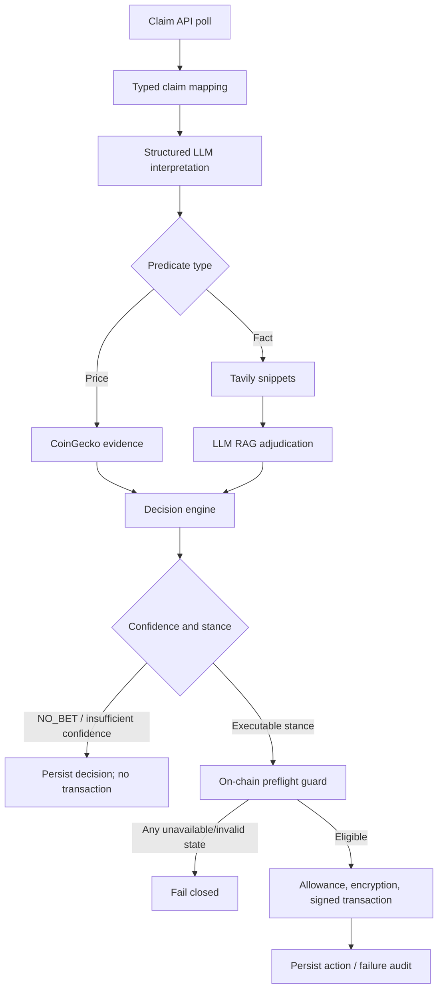
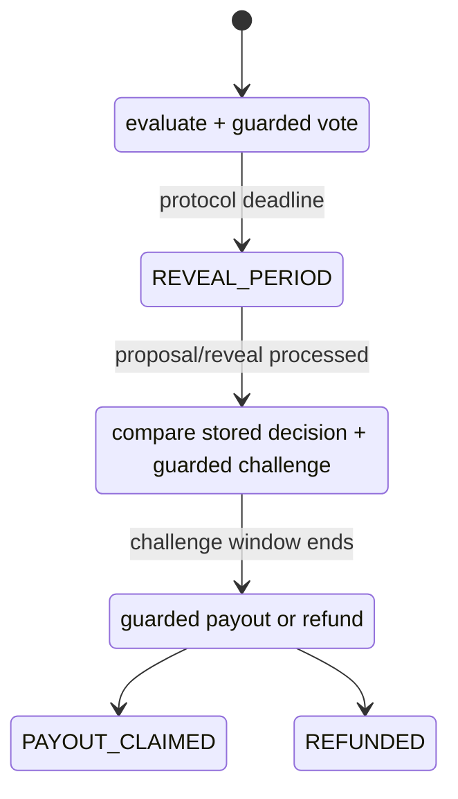

# Architecture

## Components

| Area | Responsibility |
| --- | --- |
| Orchestrator (`src/main.py`) | Starts the polling loop, initializes dependencies and database sessions, and coordinates evaluation/execution. |
| Ingestion | Fetches claim records and converts raw API payloads into typed `Claim` objects. |
| Interpretation | Uses structured LLM output to turn natural-language claims into executable predicates. |
| Research / RAG | Fetches price data or Tavily search snippets; factual claims are adjudicated with the snippets as model context. |
| Decision engine | Produces `TRUE`, `FALSE`, or `NO_BET` and a confidence score. |
| Guard + execution layer | Reads contract state, validates eligibility, encrypts votes, builds/signs transactions, and decodes reverts. |
| Persistence | SQLAlchemy models store claims, decisions, actions, and failed transaction audit records. |
| Background poller | Tracks challenge and closed states, then coordinates challenge/payout/refund work. |

## Control flow

## State transitions

The API model represents `OPEN_FOR_BETTING`, `REVEAL_PERIOD`, `CHALLENGE_PERIOD`, and `CLOSED`. The local persistence layer adds operational tracking such as `AWAITING_CHALLENGE`, `PAYOUT_CLAIMED`, and `REFUNDED`.

## Integrations and failure boundaries

The runtime may integrate with a claim API, an EVM JSON-RPC provider, OpenAI, Tavily, CoinGecko, optional Slack alerting, and SQLite or Postgres. URLs, contract identifiers, credentials, keys, and webhooks are environment-only values in this public release.

Each integration is a failure boundary. HTTP and LLM failures return no evidence or no decision; transaction preflight failures reject execution; contract reverts are decoded and recorded where the calling path supplies a session. The poll loop logs the failure and continues rather than treating a single bad claim as a process-wide success condition.

## Safeguards, persistence, and deployment

- Multicall3 batches state reads for multiple claims before execution.
- A preflight error or missing round data rejects a batch entry; it never permits an unverified bet.
- The wallet uses pending nonce reads, EIP-1559 transaction fields, gas estimates with buffers, and receipt checks.
- Vote stances are RSA-OAEP encrypted before the contract call.
- Insufficient balance can trip a process-local betting circuit breaker.
- SQLAlchemy records the claim, decision, action, and failed transaction lifecycle.
- Raw API bodies and full RAG reasoning are not emitted by the public code path.

A production deployment should use an isolated runtime with injected secret storage, a non-ephemeral database, constrained egress, a dedicated least-funded wallet, and external health/metric collection. No production endpoints or deployment credentials are included here.
